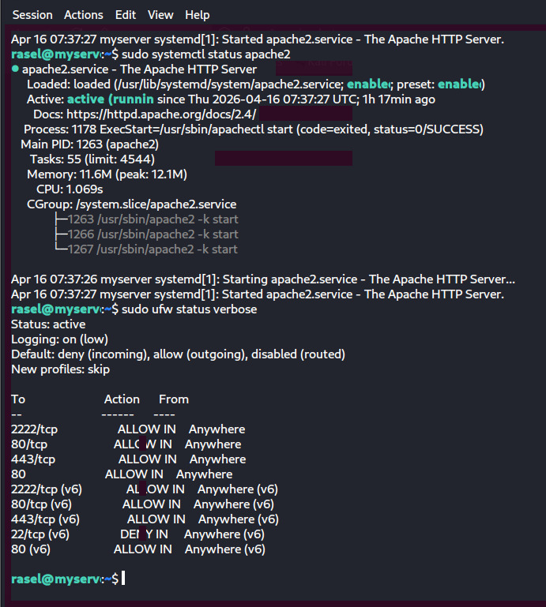
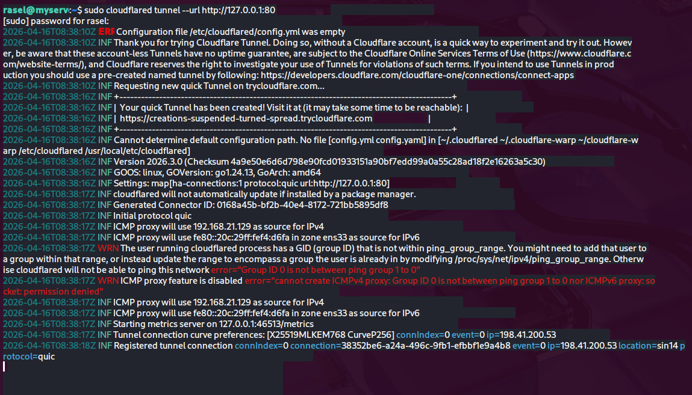
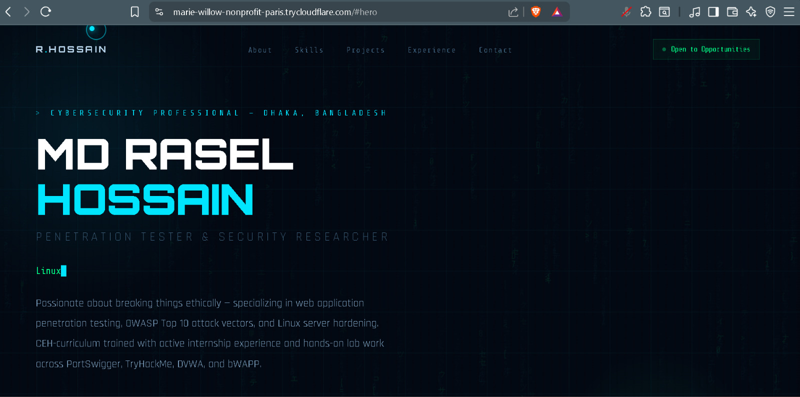
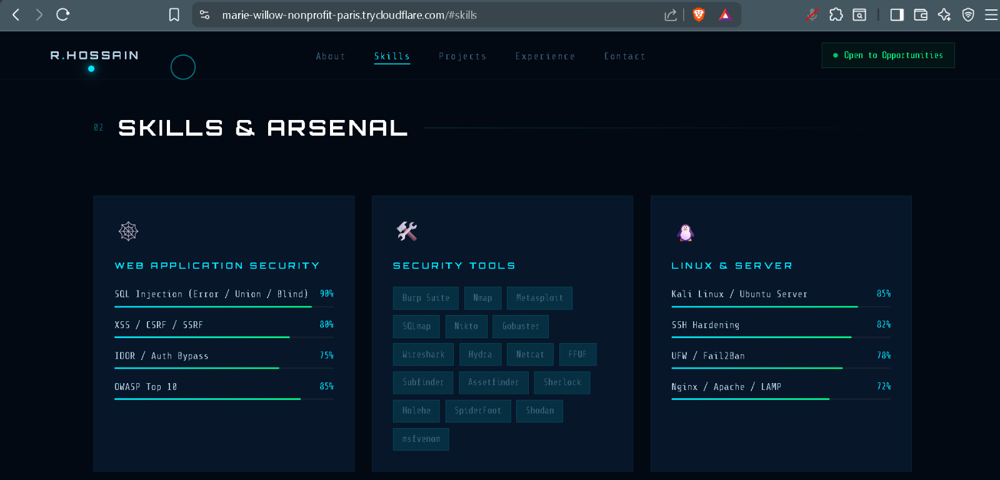
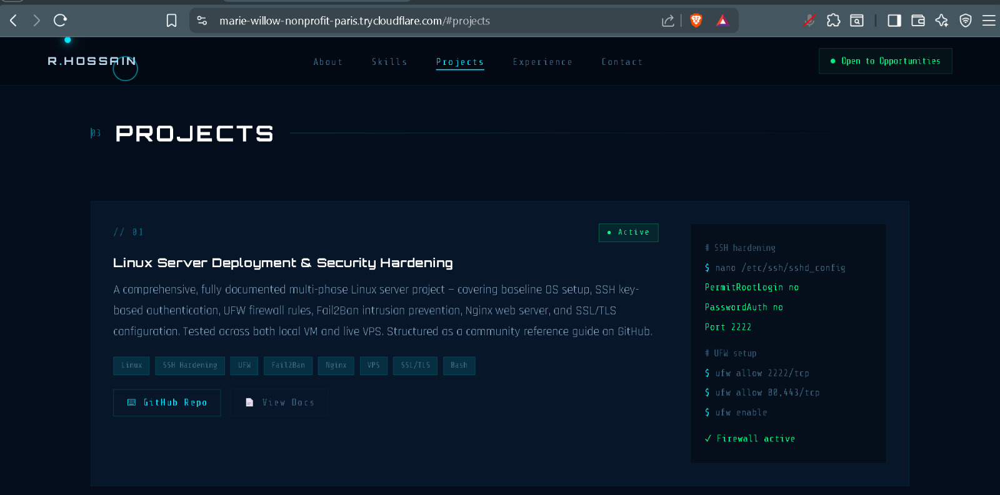

# 🖥️ Local-VM — Server Setup & Hardening

> Hands-on practice environment running Ubuntu Server on a local virtual machine.
> All phases are practiced here first before replicating on a live VPS.

---

## 🧪 Environment Details

| Item | Details |
|------|---------|
| Platform | VirtualBox / VMware |
| OS | Ubuntu Server 22.04 |
| Purpose | Practice & learning |
| Network | Host-only / NAT (local access only) |

---

## 📂 Phases

| Phase | Topic |
|-------|-------|
| 0 | Baseline Setup (Ubuntu + Apache + SSH) |
| 1 | SSH Hardening |
| 2 | UFW Firewall |
| 3 | Server Basic Security |
| 4 | Fail2Ban (Brute-force Protection) |
| 5 | Real Deployment (Cloudflare Tunnel) |
| 6 | HTTPS / SSL — ⏭️ Continuing on Online VPS |
| 7 | Clean Production Setup — ⏭️ Continuing on Online VPS |

---

## 📸 Screenshots

### Phase 0 — Baseline Setup & Phase 2 — UFW Firewall

### Phase 5 — Real Deployment (Cloudflare Tunnel)

---

## 🌐 Live Deployment Showcase

The Phase 5 deployment was used to temporarily expose a personal portfolio site through the Cloudflare Tunnel, demonstrating end-to-end reachability from local VM to public internet.

---

> 💡 *Complete all phases here first — then move to Online VPS.*
